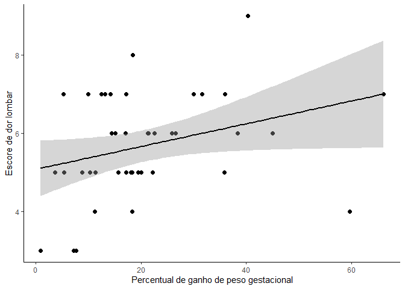

# Análises Exploratórias - *Dor lombar e ganho de peso na gestação*

### Prof. Patricia Colombo

## Pacotes

## Carregar os dados

``` r
dados_pat_colombo <- read_excel("dados_pat_colombo.xlsx")
```

## Filtra as linhas com apenas as observações

``` r
df <- dados_pat_colombo[1:53,]
```

## Ajusta as variáveis

``` r
df <- 
  df |> 
  mutate(
    score_dor = as.numeric(score_dor),
    imc_pre_gestacional = as.numeric(imc_pre_gestacional),
    imc_pos_gestacional = as.numeric(imc_pos_gestacional),
    'estado_conjugal_com _1_sem_2' = as.factor('estado_conjugal_com _1_sem_2'),
    renda = as.factor(renda),
    uso_medicamento_sim_1_n_2 = as.factor(uso_medicamento_sim_1_n_2),
    tabaco_sim_1_n_2 = as.factor(tabaco_sim_1_n_2),
    atvfisica_sim_1_n_2 = as.factor(atvfisica_sim_1_n_2)
  ) |>
  mutate(
    peso_nascer_categ = case_when(
      peso_nascer < 2500 ~ "baixo_peso",
      peso_nascer >= 2500 & peso_nascer < 4000 ~ "normal",
      peso_nascer >= 4000 ~ "acima_peso"
    )
  ) |> 
  as.data.frame()
```

## Resumo dos dados

### Tipos de variáveis

``` r
glimpse(df)
```

    ## Rows: 53
    ## Columns: 39
    ## $ id                             <chr> "E.S.S", "S.C", "V.S. S", "J.LM.D", "M.…
    ## $ idade                          <dbl> 32, 38, 38, 20, 22, 30, 36, 33, 32, 28,…
    ## $ estatura                       <dbl> 1.69, 1.60, 1.60, 1.57, 1.63, 1.67, 1.6…
    ## $ imc_pre_gestacional            <dbl> 27.7, 19.5, 23.4, 28.4, 19.6, 32.3, 39.…
    ## $ imc_pos_gestacional            <dbl> 31.9, 23.8, 30.9, 34.5, 27.1, 35.1, 45.…
    ## $ peso_pre_gestacional           <dbl> 79, 49, 60, 70, 52, 90, 105, 92, 54, 10…
    ## $ idade_gestacional_1            <dbl> 5, 12, 12, 14, 12, 8, 12, 12, 18, 14, 1…
    ## $ peso_1                         <dbl> 81, 52, 63, 73, 53, 89, 106, 94, 61, 10…
    ## $ idade_gestacional_2            <dbl> 12, 16, 18, 18, 16, 14, 18, 16, 23, 18,…
    ## $ peso_2                         <dbl> 82, 53, 65, 75, 54, 89, 110, 96, 63, 10…
    ## $ idade_gestacional_3            <dbl> 18, 20, 22, 22, 20, 20, 22, 20, 30, 24,…
    ## $ peso_3                         <dbl> 84, 54, 69, 79, 59, 91, 112, 99, 65, 10…
    ## $ idade_gestacional_4            <dbl> 26, 26, 26, 26, 24, 26, 26, 24, 37, 28,…
    ## $ peso_4                         <dbl> 86, 55, 73, 80, 60, 94, 118, 105, 66, 1…
    ## $ idade_gestacional_5            <dbl> 32, 32, 33, 30, 28, 34, 32, 28, 38, 34,…
    ## $ peso_5                         <dbl> 88, 58, 77, 82, 65, 96, 120, 108, 68, 1…
    ## $ idade_gestacional_6            <dbl> 36, 36, 37, 34, 32, 37, 36, 35, 39, 36,…
    ## $ peso_6                         <dbl> 91, 61, 79, 85, 72, 98, 120, 110, 68, 1…
    ## $ ganho_peso_gestacional         <dbl> 15.10, 22.20, 31.60, 21.40, 38.40, 8.88…
    ## $ `estado_conjugal_com _1_sem_2` <fct> estado_conjugal_com _1_sem_2, estado_co…
    ## $ idade_gestacional_parto        <dbl> 38, 37, 41, 40, 38, 39, 40, 38, 40, 38,…
    ## $ profissao_classe               <dbl> 1, 2, 2, 2, 2, 2, 2, 2, 2, 2, 2, 2, 2, …
    ## $ profissao                      <chr> "agente saude", "Assi. Esc", "Atendent"…
    ## $ renda                          <fct> 2, 2, 2, 2, 2, 2, 2, 2, 2, 2, 2, 2, 2, …
    ## $ uso_medicamento_sim_1_n_2      <fct> 2, 2, 2, 2, 2, 2, 1, 2, 2, 2, 2, 2, 2, …
    ## $ tabaco_sim_1_n_2               <fct> 2, 2, 2, 2, 2, 2, 2, 2, 2, 2, 2, 2, 2, …
    ## $ atvfisica_sim_1_n_2            <fct> 2, 1, 2, 2, 2, 2, 2, 2, 2, 1, 2, 2, 2, …
    ## $ tempo_atividade_minutos        <chr> NA, "120 minut", NA, NA, NA, NA, NA, NA…
    ## $ qual_atividade                 <chr> NA, "natacao", NA, NA, NA, NA, NA, NA, …
    ## $ numeros_gestacoes              <dbl> 2, 1, 2, 1, 1, 3, 2, 2, 1, 1, 1, 2, 2, …
    ## $ quantos_abortos                <dbl> 0, 0, 0, 0, 0, 0, 0, 0, 0, 0, 0, 0, 0, …
    ## $ quantos_partos                 <dbl> 2, 1, 2, 1, 1, 3, 2, 2, 1, 1, 1, 2, 2, …
    ## $ tipo_parto                     <chr> "V", "V", "V", "V", "V", "C", "C", "V",…
    ## $ peso_nascer                    <dbl> 2990, 2450, 3200, 3600, 3200, 3350, 350…
    ## $ local_dor                      <chr> "lombar", "lombar", "lombar", "lombar",…
    ## $ tipo_dor                       <chr> "p", "p", "p", "p", "p", "p", "p", "p",…
    ## $ score_dor                      <dbl> 6, 5, 7, 6, 6, 5, 7, 5, 6, 0, 0, 5, 3, …
    ## $ classificacao                  <chr> "moderado", "moderado", "moderado", "mo…
    ## $ peso_nascer_categ              <chr> "normal", "baixo_peso", "normal", "norm…

### Análise descritiva

``` r
skimr::skim_without_charts(df)
```

|                                                  |      |
|:-------------------------------------------------|:-----|
| Name                                             | df   |
| Number of rows                                   | 53   |
| Number of columns                                | 39   |
| \_\_\_\_\_\_\_\_\_\_\_\_\_\_\_\_\_\_\_\_\_\_\_   |      |
| Column type frequency:                           |      |
| character                                        | 9    |
| factor                                           | 5    |
| numeric                                          | 25   |
| \_\_\_\_\_\_\_\_\_\_\_\_\_\_\_\_\_\_\_\_\_\_\_\_ |      |
| Group variables                                  | None |

Data summary

**Variable type: character**

| skim_variable           | n_missing | complete_rate | min | max | empty | n_unique | whitespace |
|:------------------------|----------:|--------------:|----:|----:|------:|---------:|-----------:|
| id                      |         0 |          1.00 |   3 |   8 |     0 |       53 |          0 |
| profissao               |         0 |          1.00 |   3 |  15 |     0 |       23 |          0 |
| tempo_atividade_minutos |        39 |          0.26 |   9 |  14 |     0 |        6 |          0 |
| qual_atividade          |        39 |          0.26 |   7 |  17 |     0 |        9 |          0 |
| tipo_parto              |         0 |          1.00 |   1 |   6 |     0 |        5 |          0 |
| local_dor               |         0 |          1.00 |   6 |   7 |     0 |        2 |          0 |
| tipo_dor                |        12 |          0.77 |   1 |   1 |     0 |        1 |          0 |
| classificacao           |         0 |          1.00 |   5 |   8 |     0 |        3 |          0 |
| peso_nascer_categ       |         0 |          1.00 |   6 |  10 |     0 |        3 |          0 |

**Variable type: factor**

| skim_variable                 | n_missing | complete_rate | ordered | n_unique | top_counts        |
|:------------------------------|----------:|--------------:|:--------|---------:|:------------------|
| estado_conjugal_com \_1_sem_2 |         0 |             1 | FALSE   |        1 | est: 53           |
| renda                         |         0 |             1 | FALSE   |        3 | 2: 40, 1: 9, 3: 4 |
| uso_medicamento_sim_1_n_2     |         0 |             1 | FALSE   |        2 | 2: 52, 1: 1       |
| tabaco_sim_1_n_2              |         0 |             1 | FALSE   |        2 | 2: 51, 1: 2       |
| atvfisica_sim_1_n_2           |         0 |             1 | FALSE   |        2 | 2: 39, 1: 14      |

**Variable type: numeric**

| skim_variable           | n_missing | complete_rate |    mean |     sd |     p0 |    p25 |     p50 |     p75 |    p100 |
|:------------------------|----------:|--------------:|--------:|-------:|-------:|-------:|--------:|--------:|--------:|
| idade                   |         0 |             1 |   28.25 |   5.87 |   18.0 |   24.0 |   29.00 |   32.00 |   42.00 |
| estatura                |         0 |             1 |    1.63 |   0.06 |    1.5 |    1.6 |    1.63 |    1.66 |    1.73 |
| imc_pre_gestacional     |         0 |             1 |   25.83 |   6.09 |   15.6 |   20.7 |   24.20 |   29.40 |   39.70 |
| imc_pos_gestacional     |         0 |             1 |   30.33 |   5.35 |   21.0 |   26.0 |   30.40 |   32.90 |   45.20 |
| peso_pre_gestacional    |         0 |             1 |   68.19 |  16.07 |   40.0 |   54.0 |   67.00 |   78.00 |  105.00 |
| idade_gestacional_1     |         0 |             1 |   11.75 |   2.38 |    5.0 |   10.0 |   12.00 |   12.00 |   20.00 |
| peso_1                  |         0 |             1 |   70.21 |  15.27 |   42.0 |   58.0 |   69.00 |   79.00 |  106.00 |
| idade_gestacional_2     |         0 |             1 |   16.36 |   2.33 |   12.0 |   16.0 |   16.00 |   18.00 |   24.00 |
| peso_2                  |         0 |             1 |   71.92 |  14.98 |   44.0 |   60.0 |   70.00 |   80.00 |  110.00 |
| idade_gestacional_3     |         0 |             1 |   21.21 |   2.59 |   16.0 |   20.0 |   20.00 |   22.00 |   30.00 |
| peso_3                  |         0 |             1 |   73.74 |  14.66 |   46.0 |   64.0 |   71.00 |   83.00 |  112.00 |
| idade_gestacional_4     |         0 |             1 |   26.26 |   2.96 |   22.0 |   24.0 |   26.00 |   28.00 |   37.00 |
| peso_4                  |         0 |             1 |   76.00 |  14.88 |   50.0 |   66.0 |   76.00 |   85.00 |  118.00 |
| idade_gestacional_5     |         0 |             1 |   30.81 |   2.51 |   26.0 |   28.0 |   30.00 |   32.00 |   38.00 |
| peso_5                  |         0 |             1 |   77.72 |  14.65 |   54.0 |   68.0 |   77.00 |   86.00 |  120.00 |
| idade_gestacional_6     |         0 |             1 |   35.08 |   1.94 |   32.0 |   34.0 |   36.00 |   36.00 |   39.00 |
| peso_6                  |         0 |             1 |   80.05 |  14.27 |   56.0 |   70.0 |   79.00 |   87.00 |  120.00 |
| ganho_peso_gestacional  |         0 |             1 |   19.29 |  13.33 |    1.0 |   10.3 |   17.20 |   23.70 |   66.00 |
| idade_gestacional_parto |         0 |             1 |   38.57 |   1.39 |   35.0 |   38.0 |   39.00 |   39.00 |   41.00 |
| profissao_classe        |         0 |             1 |    1.64 |   0.48 |    1.0 |    1.0 |    2.00 |    2.00 |    2.00 |
| numeros_gestacoes       |         0 |             1 |    2.21 |   1.88 |    1.0 |    1.0 |    2.00 |    3.00 |   12.00 |
| quantos_abortos         |         0 |             1 |    0.32 |   0.67 |    0.0 |    0.0 |    0.00 |    0.00 |    3.00 |
| quantos_partos          |         0 |             1 |    1.89 |   1.42 |    1.0 |    1.0 |    2.00 |    2.00 |   10.00 |
| peso_nascer             |         0 |             1 | 3089.25 | 480.14 | 2100.0 | 2800.0 | 3185.00 | 3400.00 | 4050.00 |
| score_dor               |         0 |             1 |    4.40 |   2.67 |    0.0 |    3.0 |    5.00 |    6.00 |    9.00 |

## Prevalência de dor lombar

``` r
freq_lombar <- df |> 
  group_by(local_dor)  |> 
  summarise(n = n()) |>  
  mutate(freq = n / sum(n) * 100) |>  
  ungroup() |> 
  arrange(freq)

freq_lombar
```

    ## # A tibble: 2 × 3
    ##   local_dor     n  freq
    ##   <chr>     <int> <dbl>
    ## 1 sem dor      12  22.6
    ## 2 lombar       41  77.4

glue( ) \### Gráfico - *Prevalência de dor lombar*

``` r
freq_lombar |> 
  mutate(
    local_dor = case_when(
      local_dor == "lombar" ~ "Com dor lombar",
      local_dor == "sem dor" ~ "Sem lombar"
    )
  ) |> 
  ggplot(aes(x = local_dor,
             y = freq,
             fill = local_dor,
             label = glue('{round(freq, 0)}%'))) +
  geom_col(colour = "black", 
           show.legend = FALSE) +
  geom_text(position = position_stack(vjust = 0.5)) +
  # labs(title = "Prevalência de dor lombar") +
  xlab(label = "") +
  ylab(label = "Frequência relativa (%)")+
  ylim(0,100) +
  scale_fill_manual(values = c("white", "#737B94")) +
  theme_classic()
```

<!-- -->

## Prevalência da classificação de dor

``` r
freq_class_dor <- df |>
  mutate(
    classificacao = case_when(
      classificacao == "moderado" ~ "Dor moderada",
      classificacao == "grave" ~ "Dor grave"
    )
  ) |> 
  filter(score_dor != 0) |> 
  group_by(classificacao)  |> 
  summarise(n = n()) |>  
  mutate(freq = n / sum(n) * 100) |>  
  ungroup() |> 
  arrange(freq)

freq_class_dor
```

    ## # A tibble: 2 × 3
    ##   classificacao     n  freq
    ##   <chr>         <int> <dbl>
    ## 1 Dor grave         2  4.88
    ## 2 Dor moderada     39 95.1

### Gráfico - *Prevalência da Classificação da dor lombar*

``` r
freq_class_dor |>
  ggplot(aes(x = fct_reorder(classificacao, freq,.desc = TRUE), classificacao,
             y = freq,
             fill = classificacao,
             label = glue('{round(freq, 0)}%'))) +
  geom_col(colour = "Black",
           show.legend = FALSE) +
  geom_text(position = position_stack(vjust = 0.5)) +
  xlab("") +
  # labs(title = "Prevalência da Classificação da dor lombar") +
  xlab(label = "") +
  ylab(label = "Frequência relativa (%)")+
  ylim(0,100) +
  scale_fill_manual(values = c( "#737B94", "white")) +
  theme_classic()
```

<!-- -->

## Gráfico de dispersão

``` r
df |>   
  filter(score_dor != 0) |> 
  ggplot(aes(x = ganho_peso_gestacional,
             y = score_dor,
             colour = classificacao)) +
  geom_point(size = 2)+
  labs(title = "Gráfigo de dispersão",
       subtitle = "Escore de dor vs. ganho de peso") +
  theme_classic()
```

<!-- -->

## Gráfico de dispersão - fit

``` r
df |>
  filter(score_dor != 0) |> 
  ggplot(aes(x = ganho_peso_gestacional,
             y = score_dor)) +
  geom_point(size = 2)+
  geom_smooth(colour = "black",method = "lm")+
  # labs(title = "Gráfigo de dispersão",
  #      subtitle = "Escore de dor vs. ganho de peso")+
  xlab("Percentual de ganho de peso gestacional") +
  ylab("Escore de dor lombar") +
  theme_classic()
```

    ## `geom_smooth()` using formula = 'y ~ x'

<!-- -->
\## Correlações

``` r
df_numeric <- df |> 
  filter(score_dor != 0) |> 
  select(where(is.numeric)) 

M <- cor(df_numeric)

resultado <- corrplot::cor.mtest(df_numeric, conf.level = .95)

corrplot::corrplot(M,
                   p.mat = resultado$p,
                   type="upper", 
                   method = "color",
                   sig.level = c(.001,.01,.05),
                   pch.cex = .9,
                   insig = "label_sig",
                   pch.col = "white", 
                   order="AOE")
```

<!-- -->

## Correlação de Pearson

``` r
correlacao <- cor.test(df_numeric$score_dor,
                       df_numeric$ganho_peso_gestacional)

correlacao
```

    ## 
    ##  Pearson's product-moment correlation
    ## 
    ## data:  df_numeric$score_dor and df_numeric$ganho_peso_gestacional
    ## t = 2.0311, df = 39, p-value = 0.0491
    ## alternative hypothesis: true correlation is not equal to 0
    ## 95 percent confidence interval:
    ##  0.001811877 0.563337048
    ## sample estimates:
    ##       cor 
    ## 0.3092899

# Modelos de regressão linear

## Filtro para retirar mulheres sem dor

``` r
df_model <- 
  df |> 
  filter(score_dor != 0) 
```

## Modelo não ajustado

``` r
model <- lm(score_dor ~ ganho_peso_gestacional, df_model)

sjPlot::tab_model(model)
```

<table style="border-collapse:collapse; border:none;">
<tr>
<th style="border-top: double; text-align:center; font-style:normal; font-weight:bold; padding:0.2cm;  text-align:left; ">
 
</th>
<th colspan="3" style="border-top: double; text-align:center; font-style:normal; font-weight:bold; padding:0.2cm; ">
score_dor
</th>
</tr>
<tr>
<td style=" text-align:center; border-bottom:1px solid; font-style:italic; font-weight:normal;  text-align:left; ">
Predictors
</td>
<td style=" text-align:center; border-bottom:1px solid; font-style:italic; font-weight:normal;  ">
Estimates
</td>
<td style=" text-align:center; border-bottom:1px solid; font-style:italic; font-weight:normal;  ">
CI
</td>
<td style=" text-align:center; border-bottom:1px solid; font-style:italic; font-weight:normal;  ">
p
</td>
</tr>
<tr>
<td style=" padding:0.2cm; text-align:left; vertical-align:top; text-align:left; ">
(Intercept)
</td>
<td style=" padding:0.2cm; text-align:left; vertical-align:top; text-align:center;  ">
5.07
</td>
<td style=" padding:0.2cm; text-align:left; vertical-align:top; text-align:center;  ">
4.35 – 5.80
</td>
<td style=" padding:0.2cm; text-align:left; vertical-align:top; text-align:center;  ">
<strong>\<0.001</strong>
</td>
</tr>
<tr>
<td style=" padding:0.2cm; text-align:left; vertical-align:top; text-align:left; ">
ganho peso gestacional
</td>
<td style=" padding:0.2cm; text-align:left; vertical-align:top; text-align:center;  ">
0.03
</td>
<td style=" padding:0.2cm; text-align:left; vertical-align:top; text-align:center;  ">
0.00 – 0.06
</td>
<td style=" padding:0.2cm; text-align:left; vertical-align:top; text-align:center;  ">
<strong>0.049</strong>
</td>
</tr>
<tr>
<td style=" padding:0.2cm; text-align:left; vertical-align:top; text-align:left; padding-top:0.1cm; padding-bottom:0.1cm; border-top:1px solid;">
Observations
</td>
<td style=" padding:0.2cm; text-align:left; vertical-align:top; padding-top:0.1cm; padding-bottom:0.1cm; text-align:left; border-top:1px solid;" colspan="3">
41
</td>
</tr>
<tr>
<td style=" padding:0.2cm; text-align:left; vertical-align:top; text-align:left; padding-top:0.1cm; padding-bottom:0.1cm;">
R<sup>2</sup> / R<sup>2</sup> adjusted
</td>
<td style=" padding:0.2cm; text-align:left; vertical-align:top; padding-top:0.1cm; padding-bottom:0.1cm; text-align:left;" colspan="3">
0.096 / 0.072
</td>
</tr>
</table>

## Modelo ajustado por idade, imc pré gestacional, atv. física (O que mais?)

``` r
modelo_ajustado <- lm(score_dor ~ ganho_peso_gestacional + idade + peso_pre_gestacional + peso_nascer_categ + numeros_gestacoes, df_model)

sjPlot::tab_model(modelo_ajustado)
```

<table style="border-collapse:collapse; border:none;">
<tr>
<th style="border-top: double; text-align:center; font-style:normal; font-weight:bold; padding:0.2cm;  text-align:left; ">
 
</th>
<th colspan="3" style="border-top: double; text-align:center; font-style:normal; font-weight:bold; padding:0.2cm; ">
score_dor
</th>
</tr>
<tr>
<td style=" text-align:center; border-bottom:1px solid; font-style:italic; font-weight:normal;  text-align:left; ">
Predictors
</td>
<td style=" text-align:center; border-bottom:1px solid; font-style:italic; font-weight:normal;  ">
Estimates
</td>
<td style=" text-align:center; border-bottom:1px solid; font-style:italic; font-weight:normal;  ">
CI
</td>
<td style=" text-align:center; border-bottom:1px solid; font-style:italic; font-weight:normal;  ">
p
</td>
</tr>
<tr>
<td style=" padding:0.2cm; text-align:left; vertical-align:top; text-align:left; ">
(Intercept)
</td>
<td style=" padding:0.2cm; text-align:left; vertical-align:top; text-align:center;  ">
2.67
</td>
<td style=" padding:0.2cm; text-align:left; vertical-align:top; text-align:center;  ">
-1.91 – 7.26
</td>
<td style=" padding:0.2cm; text-align:left; vertical-align:top; text-align:center;  ">
0.244
</td>
</tr>
<tr>
<td style=" padding:0.2cm; text-align:left; vertical-align:top; text-align:left; ">
ganho peso gestacional
</td>
<td style=" padding:0.2cm; text-align:left; vertical-align:top; text-align:center;  ">
0.04
</td>
<td style=" padding:0.2cm; text-align:left; vertical-align:top; text-align:center;  ">
0.00 – 0.09
</td>
<td style=" padding:0.2cm; text-align:left; vertical-align:top; text-align:center;  ">
<strong>0.049</strong>
</td>
</tr>
<tr>
<td style=" padding:0.2cm; text-align:left; vertical-align:top; text-align:left; ">
idade
</td>
<td style=" padding:0.2cm; text-align:left; vertical-align:top; text-align:center;  ">
0.04
</td>
<td style=" padding:0.2cm; text-align:left; vertical-align:top; text-align:center;  ">
-0.04 – 0.12
</td>
<td style=" padding:0.2cm; text-align:left; vertical-align:top; text-align:center;  ">
0.342
</td>
</tr>
<tr>
<td style=" padding:0.2cm; text-align:left; vertical-align:top; text-align:left; ">
peso pre gestacional
</td>
<td style=" padding:0.2cm; text-align:left; vertical-align:top; text-align:center;  ">
0.02
</td>
<td style=" padding:0.2cm; text-align:left; vertical-align:top; text-align:center;  ">
-0.02 – 0.05
</td>
<td style=" padding:0.2cm; text-align:left; vertical-align:top; text-align:center;  ">
0.335
</td>
</tr>
<tr>
<td style=" padding:0.2cm; text-align:left; vertical-align:top; text-align:left; ">
peso nascer categ<br>\[baixo_peso\]
</td>
<td style=" padding:0.2cm; text-align:left; vertical-align:top; text-align:center;  ">
-0.75
</td>
<td style=" padding:0.2cm; text-align:left; vertical-align:top; text-align:center;  ">
-3.64 – 2.13
</td>
<td style=" padding:0.2cm; text-align:left; vertical-align:top; text-align:center;  ">
0.599
</td>
</tr>
<tr>
<td style=" padding:0.2cm; text-align:left; vertical-align:top; text-align:left; ">
peso nascer categ<br>\[normal\]
</td>
<td style=" padding:0.2cm; text-align:left; vertical-align:top; text-align:center;  ">
0.01
</td>
<td style=" padding:0.2cm; text-align:left; vertical-align:top; text-align:center;  ">
-2.74 – 2.76
</td>
<td style=" padding:0.2cm; text-align:left; vertical-align:top; text-align:center;  ">
0.996
</td>
</tr>
<tr>
<td style=" padding:0.2cm; text-align:left; vertical-align:top; text-align:left; ">
numeros gestacoes
</td>
<td style=" padding:0.2cm; text-align:left; vertical-align:top; text-align:center;  ">
0.00
</td>
<td style=" padding:0.2cm; text-align:left; vertical-align:top; text-align:center;  ">
-0.25 – 0.25
</td>
<td style=" padding:0.2cm; text-align:left; vertical-align:top; text-align:center;  ">
0.986
</td>
</tr>
<tr>
<td style=" padding:0.2cm; text-align:left; vertical-align:top; text-align:left; padding-top:0.1cm; padding-bottom:0.1cm; border-top:1px solid;">
Observations
</td>
<td style=" padding:0.2cm; text-align:left; vertical-align:top; padding-top:0.1cm; padding-bottom:0.1cm; text-align:left; border-top:1px solid;" colspan="3">
41
</td>
</tr>
<tr>
<td style=" padding:0.2cm; text-align:left; vertical-align:top; text-align:left; padding-top:0.1cm; padding-bottom:0.1cm;">
R<sup>2</sup> / R<sup>2</sup> adjusted
</td>
<td style=" padding:0.2cm; text-align:left; vertical-align:top; padding-top:0.1cm; padding-bottom:0.1cm; text-align:left;" colspan="3">
0.212 / 0.073
</td>
</tr>
</table>

# Considerações finais

As análises preliminares sugerem:

1.  Elevada prevalência de dor lombar (77%);

2.  Uma relação linear entre *ganho de peso* e *dor lombar*.

3.  O modelo ajustado por idade, IMC pré gestacional e atividade física
    sugere que mesmo após os ajustes a relação ainda é significante,
    indicando que o *ganho de peso* é um preditor significante
    independente das covariaveis incluídas no modelo.

Contudo, o modelo ajustado ainda me parece bastante simples e é
necessário ver com as especialistas (Pat e Francisca) a possibilidade de
incluir outras covariáveis no modelo.
