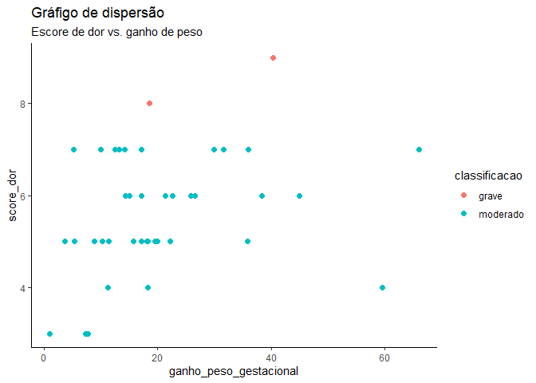
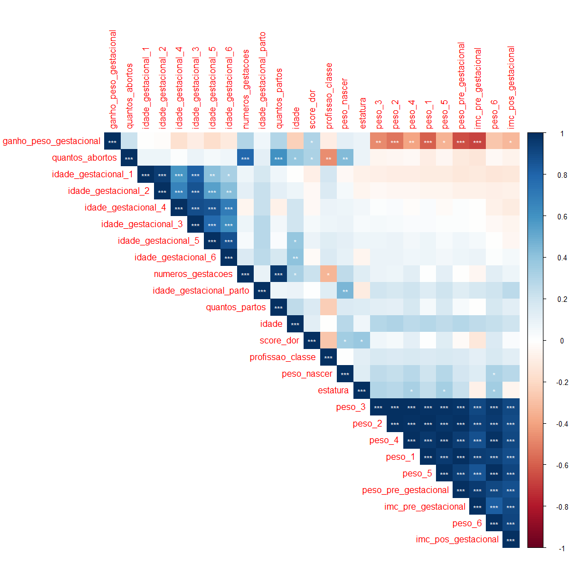

---
output:
  word_document: default
  html_document: default
  pdf_document: default
---

# Análises Exploratórias - *Dor lombar e ganho de peso na gestação*

### Prof. Patricia Colombo

## Pacotes

## Carregar os dados

``` r
dados_pat_colombo <- read_excel("dados_pat_colombo.xlsx")
```

## Filtra as linhas com apenas as observações

``` r
df <- dados_pat_colombo[1:53,]
```

## Ajusta as variáveis

``` r
df <- 
  df |> 
  mutate(
    score_dor = as.numeric(score_dor),
    imc_pre_gestacional = as.numeric(imc_pre_gestacional),
    imc_pos_gestacional = as.numeric(imc_pos_gestacional),
    'estado_conjugal_com _1_sem_2' = as.factor('estado_conjugal_com _1_sem_2'),
    renda = as.factor(renda),
    uso_medicamento_sim_1_n_2 = as.factor(uso_medicamento_sim_1_n_2),
    tabaco_sim_1_n_2 = as.factor(tabaco_sim_1_n_2),
    atvfisica_sim_1_n_2 = as.factor(atvfisica_sim_1_n_2)
  ) |>
  as.data.frame()
```

## Resumo dos dados

### Tipos de variáveis

``` r
glimpse(df)
```

    ## Rows: 53
    ## Columns: 37
    ## $ id                             <chr> "T.S", "C.F", "J.S", "C. F", "K.C.S", "…
    ## $ idade                          <dbl> 29, 19, 35, 29, 21, 38, 38, 30, 29, 26,…
    ## $ estatura                       <dbl> 1.73, 1.70, 1.69, 1.65, 1.60, 1.60, 1.6…
    ## $ imc_pre_gestacional            <dbl> 23.4, 18.0, 30.1, 21.3, 15.6, 23.4, 19.…
    ## $ imc_pos_gestacional            <dbl> 27.7, 25.3, 33.3, 25.0, 22.7, 30.9, 23.…
    ## $ peso_pre_gestacional           <dbl> 70, 52, 86, 58, 40, 60, 49, 50, 70, 49,…
    ## $ idade_gestacional_1            <dbl> 12, 7, 16, 10, 12, 12, 12, 14, 12, 12, …
    ## $ peso_1                         <dbl> 73, 56, 87, 60, 42, 63, 52, 55, 70, 50,…
    ## $ idade_gestacional_2            <dbl> 16, 12, 20, 14, 18, 18, 16, 18, 16, 16,…
    ## $ peso_2                         <dbl> 75, 59, 88, 63, 44, 65, 53, 65, 72, 52,…
    ## $ idade_gestacional_3            <dbl> 20, 18, 28, 18, 22, 22, 20, 22, 24, 20,…
    ## $ peso_3                         <dbl> 76, 61, 90, 64, 46, 69, 54, 70, 74, 53,…
    ## $ idade_gestacional_4            <dbl> 24, 24, 34, 22, 28, 26, 26, 24, 28, 25,…
    ## $ peso_4                         <dbl> 79, 67, 92, 65, 50, 73, 55, 78, 76, 55,…
    ## $ idade_gestacional_5            <dbl> 32, 28, 36, 30, 32, 33, 32, 30, 32, 30,…
    ## $ peso_5                         <dbl> 80, 70, 94, 66, 54, 77, 58, 80, 77, 56,…
    ## $ idade_gestacional_6            <dbl> 36, 32, 38, 36, 37, 37, 36, 36, 36, 35,…
    ## $ peso_6                         <dbl> 83.0, 73.0, 95.0, 68.0, 58.0, 79.0, 61.…
    ## $ ganho_peso_gestacional         <dbl> 18.50, 40.30, 10.00, 17.20, 45.00, 31.6…
    ## $ `estado_conjugal_com _1_sem_2` <fct> estado_conjugal_com _1_sem_2, estado_co…
    ## $ idade_gestacional_parto        <dbl> 38, 37, 39, 38, 39, 41, 37, 40, 39, 38,…
    ## $ profissao                      <chr> "cabeleireira", "lar", "lar", "aux, esc…
    ## $ renda                          <fct> 2, 2, 2, 2, 1, 2, 2, 1, 2, 2, 1, 2, 1, …
    ## $ uso_medicamento_sim_1_n_2      <fct> 2, 2, 2, 2, 2, 2, 2, 2, 2, 2, 2, 2, 2, …
    ## $ tabaco_sim_1_n_2               <fct> 2, 2, 2, 2, 2, 2, 2, 1, 2, 2, 2, 2, 2, …
    ## $ atvfisica_sim_1_n_2            <fct> 2, 2, 2, 2, 1, 2, 1, 2, 2, 1, 1, 2, 2, …
    ## $ tempo_atividade_minutos        <chr> NA, NA, NA, NA, "60 minutos", NA, "120 …
    ## $ qual_atividade                 <chr> NA, NA, NA, NA, "caminhada 3x", NA, "na…
    ## $ numeros_gestacoes              <dbl> 4, 2, 4, 1, 2, 2, 1, 12, 2, 1, 3, 1, 1,…
    ## $ quantos_abortos                <dbl> 1, 0, 1, 0, 0, 0, 0, 2, 0, 0, 0, 0, 0, …
    ## $ quantos_partos                 <dbl> 3, 2, 3, 1, 2, 2, 1, 10, 2, 1, 3, 1, 1,…
    ## $ tipo_parto                     <chr> "2V 1 C", "V", "C", "V", "V", "V", "V",…
    ## $ peso_nascer                    <chr> "3120", "3140", "3810", "3500", "3000",…
    ## $ local_dor                      <chr> "lombar", "lombar", "lombar", "lombar",…
    ## $ tipo_dor                       <chr> "p", "p", "p", "p", "p", "p", "p", "p",…
    ## $ score_dor                      <dbl> 8, 9, 7, 5, 6, 7, 5, 7, 5, 4, 3, 6, 6, …
    ## $ classificacao                  <chr> "grave", "grave", "moderado", "moderado…

### Análise descritiva

``` r
skimr::skim_without_charts(df)
```

|                                                  |      |
|:-------------------------------------------------|:-----|
| Name                                             | df   |
| Number of rows                                   | 53   |
| Number of columns                                | 37   |
| \_\_\_\_\_\_\_\_\_\_\_\_\_\_\_\_\_\_\_\_\_\_\_   |      |
| Column type frequency:                           |      |
| character                                        | 9    |
| factor                                           | 5    |
| numeric                                          | 23   |
| \_\_\_\_\_\_\_\_\_\_\_\_\_\_\_\_\_\_\_\_\_\_\_\_ |      |
| Group variables                                  | None |

Data summary

**Variable type: character**

| skim_variable           | n_missing | complete_rate | min | max | empty | n_unique | whitespace |
|:------------------------|----------:|--------------:|----:|----:|------:|---------:|-----------:|
| id                      |         0 |          1.00 |   3 |   8 |     0 |       53 |          0 |
| profissao               |         0 |          1.00 |   3 |  15 |     0 |       23 |          0 |
| tempo_atividade_minutos |        39 |          0.26 |   9 |  14 |     0 |        6 |          0 |
| qual_atividade          |        39 |          0.26 |   7 |  17 |     0 |        9 |          0 |
| tipo_parto              |         0 |          1.00 |   1 |   6 |     0 |        5 |          0 |
| peso_nascer             |         0 |          1.00 |   4 |   4 |     0 |       39 |          0 |
| local_dor               |         0 |          1.00 |   6 |   7 |     0 |        2 |          0 |
| tipo_dor                |        12 |          0.77 |   1 |   1 |     0 |        1 |          0 |
| classificacao           |         0 |          1.00 |   5 |   8 |     0 |        3 |          0 |

**Variable type: factor**

| skim_variable                 | n_missing | complete_rate | ordered | n_unique | top_counts        |
|:------------------------------|----------:|--------------:|:--------|---------:|:------------------|
| estado_conjugal_com \_1_sem_2 |         0 |             1 | FALSE   |        1 | est: 53           |
| renda                         |         0 |             1 | FALSE   |        3 | 2: 40, 1: 9, 3: 4 |
| uso_medicamento_sim_1_n_2     |         0 |             1 | FALSE   |        2 | 2: 52, 1: 1       |
| tabaco_sim_1_n_2              |         0 |             1 | FALSE   |        2 | 2: 51, 1: 2       |
| atvfisica_sim_1_n_2           |         0 |             1 | FALSE   |        2 | 2: 39, 1: 14      |

**Variable type: numeric**

| skim_variable           | n_missing | complete_rate |  mean |    sd |   p0 |  p25 |   p50 |   p75 |   p100 |
|:------------------------|----------:|--------------:|------:|------:|-----:|-----:|------:|------:|-------:|
| idade                   |         0 |             1 | 28.25 |  5.87 | 18.0 | 24.0 | 29.00 | 32.00 |  42.00 |
| estatura                |         0 |             1 |  1.63 |  0.06 |  1.5 |  1.6 |  1.63 |  1.66 |   1.73 |
| imc_pre_gestacional     |         0 |             1 | 25.65 |  6.44 |  9.6 | 20.7 | 24.20 | 29.40 |  39.70 |
| imc_pos_gestacional     |         0 |             1 | 30.33 |  5.35 | 21.0 | 26.0 | 30.40 | 32.90 |  45.20 |
| peso_pre_gestacional    |         0 |             1 | 68.19 | 16.07 | 40.0 | 54.0 | 67.00 | 78.00 | 105.00 |
| idade_gestacional_1     |         0 |             1 | 11.75 |  2.38 |  5.0 | 10.0 | 12.00 | 12.00 |  20.00 |
| peso_1                  |         0 |             1 | 70.21 | 15.27 | 42.0 | 58.0 | 69.00 | 79.00 | 106.00 |
| idade_gestacional_2     |         0 |             1 | 16.36 |  2.33 | 12.0 | 16.0 | 16.00 | 18.00 |  24.00 |
| peso_2                  |         0 |             1 | 71.92 | 14.98 | 44.0 | 60.0 | 70.00 | 80.00 | 110.00 |
| idade_gestacional_3     |         0 |             1 | 21.21 |  2.59 | 16.0 | 20.0 | 20.00 | 22.00 |  30.00 |
| peso_3                  |         0 |             1 | 73.74 | 14.66 | 46.0 | 64.0 | 71.00 | 83.00 | 112.00 |
| idade_gestacional_4     |         0 |             1 | 26.26 |  2.96 | 22.0 | 24.0 | 26.00 | 28.00 |  37.00 |
| peso_4                  |         0 |             1 | 76.00 | 14.88 | 50.0 | 66.0 | 76.00 | 85.00 | 118.00 |
| idade_gestacional_5     |         0 |             1 | 30.81 |  2.51 | 26.0 | 28.0 | 30.00 | 32.00 |  38.00 |
| peso_5                  |         0 |             1 | 77.72 | 14.65 | 54.0 | 68.0 | 77.00 | 86.00 | 120.00 |
| idade_gestacional_6     |         0 |             1 | 35.08 |  1.94 | 32.0 | 34.0 | 36.00 | 36.00 |  39.00 |
| peso_6                  |         0 |             1 | 80.05 | 14.27 | 56.0 | 70.0 | 79.00 | 87.00 | 120.00 |
| ganho_peso_gestacional  |         0 |             1 | 19.29 | 13.33 |  1.0 | 10.3 | 17.20 | 23.70 |  66.00 |
| idade_gestacional_parto |         0 |             1 | 38.57 |  1.39 | 35.0 | 38.0 | 39.00 | 39.00 |  41.00 |
| numeros_gestacoes       |         0 |             1 |  2.21 |  1.88 |  1.0 |  1.0 |  2.00 |  3.00 |  12.00 |
| quantos_abortos         |         0 |             1 |  0.32 |  0.67 |  0.0 |  0.0 |  0.00 |  0.00 |   3.00 |
| quantos_partos          |         0 |             1 |  1.89 |  1.42 |  1.0 |  1.0 |  2.00 |  2.00 |  10.00 |
| score_dor               |         0 |             1 |  4.40 |  2.67 |  0.0 |  3.0 |  5.00 |  6.00 |   9.00 |

## Prevalência de dor lombar

``` r
freq_lombar <- df |> 
  group_by(local_dor)  |> 
  summarise(n = n()) |>  
  mutate(freq = n / sum(n) * 100) |>  
  ungroup() |> 
  arrange(freq)

freq_lombar
```

    ## # A tibble: 2 × 3
    ##   local_dor     n  freq
    ##   <chr>     <int> <dbl>
    ## 1 sem dor      12  22.6
    ## 2 lombar       41  77.4

### Gráfico - *Prevalência de dor lombar*

``` r
freq_lombar |> 
  ggplot(aes(x = local_dor,
             y = freq, 
             fill = local_dor,
             label = round(freq, 1))) +
  geom_col() +
  geom_text(position = position_stack(vjust = 0.5)) +
  labs(title = "Prevalência de dor lombar") +
  theme_classic()
```

<!-- -->

## Prevalência da classificação de dor

``` r
freq_class_dor <- df |>
  group_by(classificacao)  |> 
  summarise(n = n()) |>  
  mutate(freq = n / sum(n) * 100) |>  
  ungroup() |> 
  arrange(freq)

freq_class_dor
```

    ## # A tibble: 3 × 3
    ##   classificacao     n  freq
    ##   <chr>         <int> <dbl>
    ## 1 grave             2  3.77
    ## 2 sem dor          12 22.6 
    ## 3 moderado         39 73.6

### Gráfico - *Prevalência da Classificação da dor lombar*

``` r
freq_class_dor |>
  ggplot(aes(x = fct_reorder(classificacao, freq,.desc = TRUE), classificacao,
             y = freq,
             fill = classificacao,
             label = round(freq, 1))) +
  geom_col() +
  geom_text(position = position_stack(vjust = 0.5)) +
  xlab("") +
  labs(title = "Prevalência da Classificação da dor lombar") +
  theme_classic()
```

<!-- -->

## Gráfico de dispersão

``` r
df |> 
  ggplot(aes(x = ganho_peso_gestacional,
             y = score_dor,
             colour = classificacao)) +
  geom_point(size = 2)+
  labs(title = "Gráfigo de dispersão",
       subtitle = "Escore de dor vs. ganho de peso") +
  theme_classic()
```

<!-- -->

## Gráfico de dispersão - fit

``` r
df |> 
  ggplot(aes(x = ganho_peso_gestacional,
             y = score_dor)) +
  geom_point(size = 2)+
  geom_smooth(method = "lm")+
  labs(title = "Gráfigo de dispersão",
       subtitle = "Escore de dor vs. ganho de peso")+
  theme_classic()
```

    ## `geom_smooth()` using formula = 'y ~ x'

<!-- -->
\## Correlações

``` r
df_numeric <- df |> 
  select(where(is.numeric)) 

M <- cor(df_numeric)

resultado <- corrplot::cor.mtest(df_numeric, conf.level = .95)

corrplot::corrplot(M,
                   p.mat = resultado$p,
                   type="upper", 
                   method = "color",
                   sig.level = c(.001,.01,.05),
                   pch.cex = .9,
                   insig = "label_sig",
                   pch.col = "white", 
                   order="AOE")
```

<!-- -->

# Modelos de regressão linear

## Modelo não ajustado

``` r
model <- lm(score_dor ~ ganho_peso_gestacional, df)

sjPlot::tab_model(model)
```

<table style="border-collapse:collapse; border:none;">
<tr>
<th style="border-top: double; text-align:center; font-style:normal; font-weight:bold; padding:0.2cm;  text-align:left; ">
 
</th>
<th colspan="3" style="border-top: double; text-align:center; font-style:normal; font-weight:bold; padding:0.2cm; ">
score_dor
</th>
</tr>
<tr>
<td style=" text-align:center; border-bottom:1px solid; font-style:italic; font-weight:normal;  text-align:left; ">
Predictors
</td>
<td style=" text-align:center; border-bottom:1px solid; font-style:italic; font-weight:normal;  ">
Estimates
</td>
<td style=" text-align:center; border-bottom:1px solid; font-style:italic; font-weight:normal;  ">
CI
</td>
<td style=" text-align:center; border-bottom:1px solid; font-style:italic; font-weight:normal;  ">
p
</td>
</tr>
<tr>
<td style=" padding:0.2cm; text-align:left; vertical-align:top; text-align:left; ">
(Intercept)
</td>
<td style=" padding:0.2cm; text-align:left; vertical-align:top; text-align:center;  ">
3.16
</td>
<td style=" padding:0.2cm; text-align:left; vertical-align:top; text-align:center;  ">
1.91 – 4.41
</td>
<td style=" padding:0.2cm; text-align:left; vertical-align:top; text-align:center;  ">
<strong>\<0.001</strong>
</td>
</tr>
<tr>
<td style=" padding:0.2cm; text-align:left; vertical-align:top; text-align:left; ">
ganho peso gestacional
</td>
<td style=" padding:0.2cm; text-align:left; vertical-align:top; text-align:center;  ">
0.06
</td>
<td style=" padding:0.2cm; text-align:left; vertical-align:top; text-align:center;  ">
0.01 – 0.12
</td>
<td style=" padding:0.2cm; text-align:left; vertical-align:top; text-align:center;  ">
<strong>0.020</strong>
</td>
</tr>
<tr>
<td style=" padding:0.2cm; text-align:left; vertical-align:top; text-align:left; padding-top:0.1cm; padding-bottom:0.1cm; border-top:1px solid;">
Observations
</td>
<td style=" padding:0.2cm; text-align:left; vertical-align:top; padding-top:0.1cm; padding-bottom:0.1cm; text-align:left; border-top:1px solid;" colspan="3">
53
</td>
</tr>
<tr>
<td style=" padding:0.2cm; text-align:left; vertical-align:top; text-align:left; padding-top:0.1cm; padding-bottom:0.1cm;">
R<sup>2</sup> / R<sup>2</sup> adjusted
</td>
<td style=" padding:0.2cm; text-align:left; vertical-align:top; padding-top:0.1cm; padding-bottom:0.1cm; text-align:left;" colspan="3">
0.102 / 0.085
</td>
</tr>
</table>

## Modelo ajustado por idade, imc pré gestacional, atv. física (O que mais?)

``` r
modelo_ajustado <- lm(score_dor ~ ganho_peso_gestacional + idade + imc_pre_gestacional + atvfisica_sim_1_n_2, df)

sjPlot::tab_model(modelo_ajustado)
```

<table style="border-collapse:collapse; border:none;">
<tr>
<th style="border-top: double; text-align:center; font-style:normal; font-weight:bold; padding:0.2cm;  text-align:left; ">
 
</th>
<th colspan="3" style="border-top: double; text-align:center; font-style:normal; font-weight:bold; padding:0.2cm; ">
score_dor
</th>
</tr>
<tr>
<td style=" text-align:center; border-bottom:1px solid; font-style:italic; font-weight:normal;  text-align:left; ">
Predictors
</td>
<td style=" text-align:center; border-bottom:1px solid; font-style:italic; font-weight:normal;  ">
Estimates
</td>
<td style=" text-align:center; border-bottom:1px solid; font-style:italic; font-weight:normal;  ">
CI
</td>
<td style=" text-align:center; border-bottom:1px solid; font-style:italic; font-weight:normal;  ">
p
</td>
</tr>
<tr>
<td style=" padding:0.2cm; text-align:left; vertical-align:top; text-align:left; ">
(Intercept)
</td>
<td style=" padding:0.2cm; text-align:left; vertical-align:top; text-align:center;  ">
-0.78
</td>
<td style=" padding:0.2cm; text-align:left; vertical-align:top; text-align:center;  ">
-5.69 – 4.13
</td>
<td style=" padding:0.2cm; text-align:left; vertical-align:top; text-align:center;  ">
0.751
</td>
</tr>
<tr>
<td style=" padding:0.2cm; text-align:left; vertical-align:top; text-align:left; ">
ganho peso gestacional
</td>
<td style=" padding:0.2cm; text-align:left; vertical-align:top; text-align:center;  ">
0.07
</td>
<td style=" padding:0.2cm; text-align:left; vertical-align:top; text-align:center;  ">
0.01 – 0.13
</td>
<td style=" padding:0.2cm; text-align:left; vertical-align:top; text-align:center;  ">
<strong>0.019</strong>
</td>
</tr>
<tr>
<td style=" padding:0.2cm; text-align:left; vertical-align:top; text-align:left; ">
idade
</td>
<td style=" padding:0.2cm; text-align:left; vertical-align:top; text-align:center;  ">
0.04
</td>
<td style=" padding:0.2cm; text-align:left; vertical-align:top; text-align:center;  ">
-0.07 – 0.14
</td>
<td style=" padding:0.2cm; text-align:left; vertical-align:top; text-align:center;  ">
0.487
</td>
</tr>
<tr>
<td style=" padding:0.2cm; text-align:left; vertical-align:top; text-align:left; ">
imc pre gestacional
</td>
<td style=" padding:0.2cm; text-align:left; vertical-align:top; text-align:center;  ">
0.01
</td>
<td style=" padding:0.2cm; text-align:left; vertical-align:top; text-align:center;  ">
-0.11 – 0.14
</td>
<td style=" padding:0.2cm; text-align:left; vertical-align:top; text-align:center;  ">
0.844
</td>
</tr>
<tr>
<td style=" padding:0.2cm; text-align:left; vertical-align:top; text-align:left; ">
atvfisica sim 1 n 2 \[2\]
</td>
<td style=" padding:0.2cm; text-align:left; vertical-align:top; text-align:center;  ">
3.35
</td>
<td style=" padding:0.2cm; text-align:left; vertical-align:top; text-align:center;  ">
2.02 – 4.67
</td>
<td style=" padding:0.2cm; text-align:left; vertical-align:top; text-align:center;  ">
<strong>\<0.001</strong>
</td>
</tr>
<tr>
<td style=" padding:0.2cm; text-align:left; vertical-align:top; text-align:left; padding-top:0.1cm; padding-bottom:0.1cm; border-top:1px solid;">
Observations
</td>
<td style=" padding:0.2cm; text-align:left; vertical-align:top; padding-top:0.1cm; padding-bottom:0.1cm; text-align:left; border-top:1px solid;" colspan="3">
53
</td>
</tr>
<tr>
<td style=" padding:0.2cm; text-align:left; vertical-align:top; text-align:left; padding-top:0.1cm; padding-bottom:0.1cm;">
R<sup>2</sup> / R<sup>2</sup> adjusted
</td>
<td style=" padding:0.2cm; text-align:left; vertical-align:top; padding-top:0.1cm; padding-bottom:0.1cm; text-align:left;" colspan="3">
0.425 / 0.377
</td>
</tr>
</table>

# Considerações finais

As análises preliminares sugerem:

1.  Elevada prevalência de dor lombar (77%);

2.  Uma relação linear entre *ganho de peso* e *dor lombar*.

3.  O modelo ajustado por idade, IMC pré gestacional e atividade física
    sugere que mesmo após os ajustes a relação ainda é significante,
    indicando que o *ganho de peso* é um preditor significante
    independente das covariaveis incluídas no modelo.

Contudo, o modelo ajustado ainda me parece bastante simples e é
necessário ver com as especialistas (Pat e Francisca) a possibilidade de
incluir outras covariáveis no modelo.
